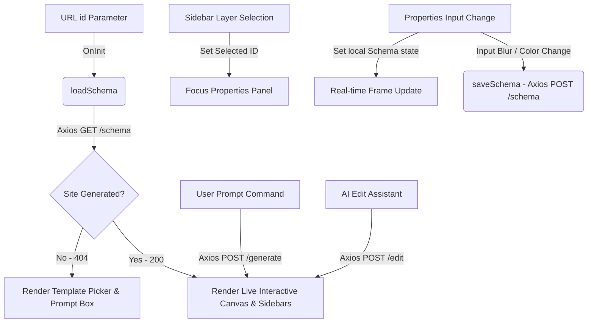

# Qevora Editor & AI Generator Integration Walkthrough

This document maps out the architecture and features implemented for the **Qevora Editor & AI Generator** integration, transitioning the editor from a static frontend mock into a dynamic, API-driven design system compiler.

---

## 1. Technical Architecture & State flow

The editor follows a unified unidirectional state flow managed by the Next.js `EditorProvider` context layer:

---

## 2. Implemented Features

### 1. Unified Schema Management (`EditorContext.tsx`)
- Imported the official `SiteSchema` directly from `@qevora/schemas`, establishing strict type contract alignment across packages.
- Added `selectedSectionId` state to track active elements on the canvas.
- Integrated all REST API operations (Get Layout, Generate, Edit, Manual Save, Publish, Domain Mapping) using the centralized Axios client.

### 2. Canvas & Real-Time Rendering (`Canvas.tsx`)
- Integrates `PageRenderer` from `@qevora/qevora-renderer` to dynamically project layout sections.
- Incorporates `injectThemeCSS` from `@qevora/design-system` to paint the active workspace head with CSS variables, allowing immediate color and spacing updates.
- Supports viewport device resizing (Desktop, Tablet, Mobile) with glassmorphic controls.
- Displays an interactive prompt widget at the bottom of the canvas for direct AI manipulations.

### 3. Dynamic Section Layers (`LeftPanel.tsx`)
- Replaced hardcoded layouts with a dynamic loop mapping active sections inside `schema.pages[0].sections`.
- Enabled text filtering to search through the list of layers.
- Wired a visibility toggle that updates `isVisible` inside the database schema and pushes real-time updates.
- Added component selection hooks that focus active styles inside the properties panel.

### 4. Interactive Property Panel (`RightPanel.tsx`)
- Added real-time global theme color picker inputs (Primary, Secondary, Background) that immediately rewrite CSS tokens and save updates.
- Dynamically generates property fields based on the selected component type:
  - **Navbar / Footer**: Custom logo and branding text inputs (in English and Arabic).
  - **Hero Section**: Live title headers, subtitles, and call-to-action button labels (in English and Arabic).
- Pushes local state updates immediately to reflect visual previews instantly, followed by a debounced save to the API on blur.

---

## 3. Resolution of Compile Warnings & Errors

During build verification, the following typescript compilation errors were identified and resolved:
1. **Missing Lucide Icon in Dashboard (`DashboardPage.tsx`)**: Imported the `Globe` icon which was missing from the standard package import list.
2. **Unsupported Prop on Common Button (`ui.tsx`)**: Added support for the `target` parameter within `ButtonProps` to allow external links to load in a new window.
3. **Invalid Lucide Icon in Canvas (`Canvas.tsx`)**: Changed `Cellphone` to `Smartphone`.
4. **SiteSchema Type Discrepancies (`EditorContext.tsx`, `TopBar.tsx`)**: Replaced the custom local `SiteSchema` interface with the formal import from `@qevora/schemas`. Replaced invalid schema properties (e.g. `schema.status`) with state hooks.
