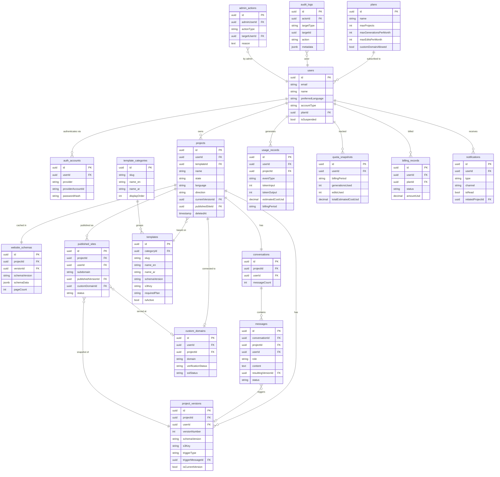

# Qevora — Database Schema Design
**Version:** 1.0 | **Date:** 2026-06-25 | **Task:** 004

---

## Global Conventions

| Convention | Rule |
|---|---|
| Primary Keys | UUID v4 (`id`) on all tables |
| Timestamps | `createdAt`, `updatedAt` on all tables |
| Soft Delete | `deletedAt` (nullable timestamp) on user-facing tables |
| Multi-tenancy | `userId` foreign key on all user-owned tables |
| Enums | Stored as VARCHAR with application-level enum validation |
| Text Language | Bilingual fields stored as `fieldName_en` + `fieldName_ar` |

---

## 1. Entity Catalog

---

### 1.1 `users`
**Purpose:** Core identity record for every registered user.

| Field | Type | Notes |
|---|---|---|
| id | UUID | PK |
| email | VARCHAR(255) | Unique, not null |
| emailVerified | BOOLEAN | Default false |
| name | VARCHAR(255) | Display name |
| avatarUrl | TEXT | Profile photo |
| preferredLanguage | VARCHAR(10) | 'en' or 'ar', default 'en' |
| accountType | VARCHAR(20) | 'individual', 'business', 'agency' |
| planId | UUID | FK → plans |
| isActive | BOOLEAN | Default true |
| isSuspended | BOOLEAN | Default false |
| suspendedAt | TIMESTAMP | Nullable |
| suspendedReason | TEXT | Nullable |
| lastLoginAt | TIMESTAMP | Nullable |
| createdAt | TIMESTAMP | |
| updatedAt | TIMESTAMP | |
| deletedAt | TIMESTAMP | Soft delete |

**Indexes:** `email` (unique), `planId`, `isActive`, `createdAt`

---

### 1.2 `auth_accounts`
**Purpose:** Links users to one or more authentication providers. A user may have Google + Email.

| Field | Type | Notes |
|---|---|---|
| id | UUID | PK |
| userId | UUID | FK → users |
| provider | VARCHAR(30) | 'google', 'github', 'apple', 'email' |
| providerAccountId | VARCHAR(255) | External provider's user ID |
| passwordHash | TEXT | Nullable; only for email provider |
| accessToken | TEXT | Nullable; OAuth token |
| refreshToken | TEXT | Nullable; OAuth refresh |
| tokenExpiresAt | TIMESTAMP | Nullable |
| createdAt | TIMESTAMP | |
| updatedAt | TIMESTAMP | |

**Indexes:** `(provider, providerAccountId)` unique, `userId`

---

### 1.3 `plans`
**Purpose:** Subscription plan definitions. Drives quota enforcement and feature flags.

| Field | Type | Notes |
|---|---|---|
| id | UUID | PK |
| name | VARCHAR(50) | 'free', 'pro', 'agency' |
| displayName_en | VARCHAR(100) | |
| displayName_ar | VARCHAR(100) | |
| monthlyPriceUsd | DECIMAL(10,2) | 0.00 for free |
| yearlyPriceUsd | DECIMAL(10,2) | Nullable |
| maxProjects | INTEGER | -1 = unlimited |
| maxPublishedSites | INTEGER | |
| maxGenerationsPerMonth | INTEGER | |
| maxEditsPerMonth | INTEGER | |
| maxPromptLengthChars | INTEGER | |
| maxPagesPerSite | INTEGER | |
| customDomainAllowed | BOOLEAN | |
| ecommerceAllowed | BOOLEAN | |
| isActive | BOOLEAN | Default true |
| createdAt | TIMESTAMP | |
| updatedAt | TIMESTAMP | |

**Indexes:** `name` (unique)

---

### 1.4 `billing_records`
**Purpose:** Tracks payment events per user.

| Field | Type | Notes |
|---|---|---|
| id | UUID | PK |
| userId | UUID | FK → users |
| planId | UUID | FK → plans |
| stripeCustomerId | VARCHAR(255) | Nullable (post-MVP) |
| stripeSubscriptionId | VARCHAR(255) | Nullable |
| stripeInvoiceId | VARCHAR(255) | Nullable |
| status | VARCHAR(30) | 'active', 'past_due', 'canceled', 'trialing' |
| amountUsd | DECIMAL(10,2) | |
| billingPeriodStart | TIMESTAMP | |
| billingPeriodEnd | TIMESTAMP | |
| createdAt | TIMESTAMP | |
| updatedAt | TIMESTAMP | |

**Indexes:** `userId`, `stripeCustomerId`, `status`

---

### 1.5 `projects`
**Purpose:** A user's website project. Central entity of the platform.

| Field | Type | Notes |
|---|---|---|
| id | UUID | PK |
| userId | UUID | FK → users |
| name | VARCHAR(255) | User-defined project name |
| templateId | UUID | FK → templates, nullable |
| state | VARCHAR(30) | See project states in PRD |
| language | VARCHAR(10) | 'en', 'ar', 'bilingual' |
| direction | VARCHAR(5) | 'ltr', 'rtl' |
| currentVersionId | UUID | FK → project_versions, nullable |
| publishedSiteId | UUID | FK → published_sites, nullable |
| generationCount | INTEGER | Total generations run |
| lastGeneratedAt | TIMESTAMP | Nullable |
| lastPublishedAt | TIMESTAMP | Nullable |
| createdAt | TIMESTAMP | |
| updatedAt | TIMESTAMP | |
| deletedAt | TIMESTAMP | Soft delete |

**Indexes:** `userId`, `state`, `deletedAt`, `createdAt DESC`

---

### 1.6 `project_versions`
**Purpose:** Immutable snapshots of a project's JSON Site Schema. Every generation or confirmed edit creates a new version.

| Field | Type | Notes |
|---|---|---|
| id | UUID | PK |
| projectId | UUID | FK → projects |
| userId | UUID | FK → users (denormalized for query speed) |
| versionNumber | INTEGER | Increments per project |
| schemaVersion | VARCHAR(10) | e.g., '1.0' — JSON Schema format version |
| s3Key | TEXT | Path to JSON file in S3 |
| triggerType | VARCHAR(30) | 'initial_generation', 'chat_edit', 'regeneration' |
| triggerMessageId | UUID | FK → messages, nullable |
| tokenUsageInput | INTEGER | Claude input tokens for this version |
| tokenUsageOutput | INTEGER | Claude output tokens |
| isCurrentVersion | BOOLEAN | True for latest version |
| createdAt | TIMESTAMP | |

**Indexes:** `projectId`, `(projectId, versionNumber)` unique, `isCurrentVersion`, `userId`

> No `updatedAt` — versions are immutable once created.

---

### 1.7 `website_schemas`
**Purpose:** Caches the parsed JSON Site Schema for fast access without hitting S3. Mirrors the active version's schema as a JSONB column.

| Field | Type | Notes |
|---|---|---|
| id | UUID | PK |
| projectId | UUID | FK → projects, unique |
| versionId | UUID | FK → project_versions |
| schemaVersion | VARCHAR(10) | |
| schemaData | JSONB | Full JSON Site Schema |
| pageCount | INTEGER | Denormalized for display |
| componentCount | INTEGER | Denormalized |
| updatedAt | TIMESTAMP | |

**Indexes:** `projectId` (unique), `versionId`

> This table is always kept in sync with the current version. Acts as a hot cache for the renderer and editor.

---

### 1.8 `conversations`
**Purpose:** A chat session tied to a project. One conversation per project (expandable to multiple in future).

| Field | Type | Notes |
|---|---|---|
| id | UUID | PK |
| projectId | UUID | FK → projects, unique |
| userId | UUID | FK → users |
| messageCount | INTEGER | Denormalized counter |
| createdAt | TIMESTAMP | |
| updatedAt | TIMESTAMP | |

**Indexes:** `projectId` (unique), `userId`

---

### 1.9 `messages`
**Purpose:** Individual chat messages within a conversation.

| Field | Type | Notes |
|---|---|---|
| id | UUID | PK |
| conversationId | UUID | FK → conversations |
| projectId | UUID | FK → projects (denormalized) |
| userId | UUID | FK → users |
| role | VARCHAR(10) | 'user' or 'assistant' |
| content | TEXT | Message body |
| language | VARCHAR(10) | Detected language of this message |
| resultingVersionId | UUID | FK → project_versions, nullable |
| tokenUsageInput | INTEGER | Nullable; only for assistant messages |
| tokenUsageOutput | INTEGER | Nullable |
| status | VARCHAR(20) | 'pending', 'completed', 'failed' |
| failureReason | TEXT | Nullable |
| createdAt | TIMESTAMP | |

**Indexes:** `conversationId`, `projectId`, `userId`, `createdAt`, `role`

---

### 1.10 `template_categories`
**Purpose:** Organizes templates by industry.

| Field | Type | Notes |
|---|---|---|
| id | UUID | PK |
| slug | VARCHAR(50) | 'real-estate', 'restaurant', etc. |
| name_en | VARCHAR(100) | |
| name_ar | VARCHAR(100) | |
| displayOrder | INTEGER | For gallery ordering |
| iconName | VARCHAR(50) | UI icon identifier |
| isActive | BOOLEAN | |
| createdAt | TIMESTAMP | |
| updatedAt | TIMESTAMP | |

**Indexes:** `slug` (unique), `isActive`

---

### 1.11 `templates`
**Purpose:** Template Registry — first-class record for every available template.

| Field | Type | Notes |
|---|---|---|
| id | UUID | PK |
| categoryId | UUID | FK → template_categories |
| slug | VARCHAR(100) | Unique identifier |
| name_en | VARCHAR(255) | |
| name_ar | VARCHAR(255) | |
| description_en | TEXT | |
| description_ar | TEXT | |
| previewImageUrl | TEXT | S3 URL |
| thumbnailUrl | TEXT | S3 URL |
| defaultLanguage | VARCHAR(10) | 'en', 'ar', 'bilingual' |
| direction | VARCHAR(5) | 'ltr', 'rtl' |
| schemaVersion | VARCHAR(10) | JSON Schema version this template uses |
| s3Key | TEXT | Path to default schema JSON in S3 |
| requiredPlan | VARCHAR(20) | 'free', 'pro', 'agency' |
| tags | TEXT[] | Array of searchable tags |
| isActive | BOOLEAN | |
| isFeatured | BOOLEAN | For gallery spotlight |
| usageCount | INTEGER | How many projects used this template |
| version | INTEGER | Template version (increments on update) |
| createdAt | TIMESTAMP | |
| updatedAt | TIMESTAMP | |

**Indexes:** `slug` (unique), `categoryId`, `isActive`, `requiredPlan`, `isFeatured`, GIN index on `tags`

---

### 1.12 `published_sites`
**Purpose:** Record of each published deployment of a project.

| Field | Type | Notes |
|---|---|---|
| id | UUID | PK |
| projectId | UUID | FK → projects |
| userId | UUID | FK → users |
| subdomain | VARCHAR(100) | e.g., 'nova' → nova.qevora.site |
| customDomainId | UUID | FK → custom_domains, nullable |
| publishedVersionId | UUID | FK → project_versions |
| s3Prefix | TEXT | Live S3 path prefix |
| cloudfrontInvalidationId | TEXT | For status tracking |
| status | VARCHAR(20) | 'publishing', 'live', 'unpublished', 'failed' |
| publishedAt | TIMESTAMP | |
| unpublishedAt | TIMESTAMP | Nullable |
| createdAt | TIMESTAMP | |
| updatedAt | TIMESTAMP | |

**Indexes:** `projectId`, `userId`, `subdomain` (unique), `status`

---

### 1.13 `custom_domains`
**Purpose:** Tracks custom domain configurations per project.

| Field | Type | Notes |
|---|---|---|
| id | UUID | PK |
| userId | UUID | FK → users |
| projectId | UUID | FK → projects |
| domain | VARCHAR(255) | e.g., 'www.example.com' |
| verificationTxtRecord | VARCHAR(255) | TXT value user must add |
| verificationStatus | VARCHAR(20) | 'pending', 'verified', 'failed' |
| verifiedAt | TIMESTAMP | Nullable |
| sslStatus | VARCHAR(20) | 'pending', 'issued', 'failed' |
| sslIssuedAt | TIMESTAMP | Nullable |
| acmCertificateArn | TEXT | AWS ACM certificate ARN |
| isActive | BOOLEAN | |
| createdAt | TIMESTAMP | |
| updatedAt | TIMESTAMP | |

**Indexes:** `domain` (unique), `userId`, `projectId`, `verificationStatus`

---

### 1.14 `usage_records`
**Purpose:** Granular per-event usage log. Used for quota enforcement and cost analysis.

| Field | Type | Notes |
|---|---|---|
| id | UUID | PK |
| userId | UUID | FK → users |
| projectId | UUID | FK → projects, nullable |
| eventType | VARCHAR(50) | 'generation', 'chat_edit', 'publish', 'image_gen' |
| tokenInput | INTEGER | Nullable |
| tokenOutput | INTEGER | Nullable |
| estimatedCostUsd | DECIMAL(10,6) | Calculated at record time |
| billingPeriod | VARCHAR(7) | '2026-06' — year-month |
| metadata | JSONB | Additional context |
| createdAt | TIMESTAMP | |

**Indexes:** `userId`, `(userId, billingPeriod)`, `(userId, eventType, billingPeriod)`, `projectId`, `createdAt`

---

### 1.15 `quota_snapshots`
**Purpose:** Cached monthly aggregates per user per billing period. Avoids counting `usage_records` on every request.

| Field | Type | Notes |
|---|---|---|
| id | UUID | PK |
| userId | UUID | FK → users |
| billingPeriod | VARCHAR(7) | '2026-06' |
| generationsUsed | INTEGER | Default 0 |
| editsUsed | INTEGER | Default 0 |
| publishesUsed | INTEGER | Default 0 |
| totalTokenInput | INTEGER | |
| totalTokenOutput | INTEGER | |
| totalEstimatedCostUsd | DECIMAL(10,4) | |
| updatedAt | TIMESTAMP | |

**Indexes:** `(userId, billingPeriod)` unique

> Incremented atomically on each usage event. The Quota Gate reads this table, not `usage_records`.

---

### 1.16 `notifications`
**Purpose:** Async notifications delivered to users (in-app or email).

| Field | Type | Notes |
|---|---|---|
| id | UUID | PK |
| userId | UUID | FK → users |
| type | VARCHAR(50) | 'generation_complete', 'publish_complete', 'quota_warning', 'domain_verified' |
| title_en | VARCHAR(255) | |
| title_ar | VARCHAR(255) | |
| body_en | TEXT | |
| body_ar | TEXT | |
| channel | VARCHAR(20) | 'in_app', 'email', 'both' |
| isRead | BOOLEAN | Default false |
| readAt | TIMESTAMP | Nullable |
| relatedProjectId | UUID | FK → projects, nullable |
| emailSentAt | TIMESTAMP | Nullable |
| emailMessageId | VARCHAR(255) | SES message ID |
| createdAt | TIMESTAMP | |

**Indexes:** `userId`, `(userId, isRead)`, `type`, `createdAt DESC`

---

### 1.17 `audit_logs`
**Purpose:** Immutable log of all significant platform events for debugging, compliance, and security.

| Field | Type | Notes |
|---|---|---|
| id | UUID | PK |
| actorId | UUID | FK → users (who did it) |
| actorType | VARCHAR(20) | 'user', 'admin', 'system' |
| targetId | UUID | ID of the affected entity |
| targetType | VARCHAR(50) | 'project', 'user', 'published_site', etc. |
| action | VARCHAR(100) | 'project.created', 'site.published', 'user.suspended' |
| metadata | JSONB | Request context, IP, UA, before/after values |
| ipAddress | VARCHAR(45) | IPv4 or IPv6 |
| userAgent | TEXT | Nullable |
| createdAt | TIMESTAMP | |

**Indexes:** `actorId`, `targetId`, `action`, `createdAt DESC`

> Audit logs are **never deleted**. No `deletedAt`.

---

### 1.18 `admin_actions`
**Purpose:** Tracks actions taken by Platform Admins specifically. Separate from audit_logs for access control.

| Field | Type | Notes |
|---|---|---|
| id | UUID | PK |
| adminUserId | UUID | FK → users (must have admin role) |
| actionType | VARCHAR(100) | 'suspend_user', 'delete_project', 'update_template', 'grant_quota' |
| targetUserId | UUID | FK → users, nullable |
| targetProjectId | UUID | FK → projects, nullable |
| reason | TEXT | Required justification |
| metadata | JSONB | Before/after state |
| createdAt | TIMESTAMP | |

**Indexes:** `adminUserId`, `targetUserId`, `actionType`, `createdAt DESC`

---

## 2. Entity Relationships

```
users ──────────────────────── 1:1 ── quota_snapshots (per billing period)
users ──────────────────────── 1:N ── auth_accounts
users ──────────────────────── 1:N ── projects
users ──────────────────────── 1:N ── billing_records
users ──────────────────────── 1:N ── usage_records
users ──────────────────────── 1:N ── notifications
users ──────────────────────── N:1 ── plans

projects ───────────────────── 1:N ── project_versions
projects ───────────────────── 1:1 ── website_schemas (active schema cache)
projects ───────────────────── 1:1 ── conversations
projects ───────────────────── 1:N ── published_sites
projects ───────────────────── 1:1 ── custom_domains (nullable)
projects ───────────────────── N:1 ── templates (nullable)

project_versions ───────────── 1:1 ── messages (trigger, nullable)

conversations ──────────────── 1:N ── messages

templates ──────────────────── N:1 ── template_categories
templates ──────────────────── 1:N ── projects (via templateId)

published_sites ────────────── N:1 ── project_versions (published snapshot)
published_sites ────────────── 1:1 ── custom_domains (nullable)

messages ───────────────────── 1:1 ── project_versions (resulting version, nullable)

usage_records ──────────────── N:1 ── users
usage_records ──────────────── N:1 ── projects
```

---

## 3. ER Diagram



---

## 4. Index Strategy

### Query Pattern Analysis

| Query | Table | Index |
|---|---|---|
| Load user's projects list | projects | `(userId, deletedAt, createdAt DESC)` |
| Check quota before AI call | quota_snapshots | `(userId, billingPeriod)` unique |
| Load active chat messages | messages | `(conversationId, createdAt ASC)` |
| Load current website schema | website_schemas | `projectId` unique |
| List versions for a project | project_versions | `(projectId, versionNumber DESC)` |
| Resolve subdomain to site | published_sites | `subdomain` unique |
| Check domain verification | custom_domains | `domain` unique |
| Unread notifications | notifications | `(userId, isRead, createdAt DESC)` |
| Admin audit trail | audit_logs | `(actorId, createdAt DESC)` |
| Monthly cost report | usage_records | `(userId, billingPeriod, eventType)` |
| Template gallery | templates | `(isActive, categoryId, isFeatured)` |
| Template tag search | templates | GIN on `tags` array |

---

## 5. Data Lifecycle Strategy

### 5.1 Multi-Tenant Strategy

Qevora uses **row-level multi-tenancy**: every user-owned table carries a `userId` column. There are no separate schemas or databases per tenant.

Enforcement:
- All API queries include `WHERE userId = :currentUserId` at the service layer
- Row-Level Security (RLS) in PostgreSQL enforced as a safety net
- Admin queries bypass RLS via a dedicated admin database role

---

### 5.2 Soft Delete Strategy

The following tables use soft delete via `deletedAt` timestamp:

| Table | Soft Delete Field | Hard Delete Policy |
|---|---|---|
| users | deletedAt | Hard delete after 90-day retention window |
| projects | deletedAt | Hard delete after 30 days post soft-delete |
| published_sites | via project deletion | Unpublish immediately; files removed after 30 days |

Tables that are **never soft-deleted** (immutable or system records):
- `project_versions` — immutable snapshots
- `audit_logs` — permanent compliance record
- `usage_records` — billing and cost tracking
- `messages` — conversation history integrity

All API queries on soft-deletable tables include `WHERE deletedAt IS NULL`.

---

### 5.3 Versioning Strategy

| Layer | Strategy |
|---|---|
| Project Versions | Append-only. Each generation/edit creates a new `project_versions` row. Never update or delete. |
| Website Schema Cache | `website_schemas` is always overwritten with the current version. Only one row per project. |
| Template Versions | `templates.version` increments on each update. Old template schemas remain in S3 for project compatibility. |
| Schema Format Versions | `schemaVersion` field on `project_versions` and `website_schemas` tracks JSON Site Schema format. |

---

### 5.4 Data Retention Strategy

| Data Type | Retention Period | Action After Retention |
|---|---|---|
| Active user data | Indefinite (while account active) | — |
| Deleted user data | 90 days post soft-delete | Anonymized then hard-deleted |
| Deleted project data | 30 days post soft-delete | Hard delete DB row; S3 files purged |
| Project versions (S3) | 90 days post project deletion | S3 lifecycle rule auto-deletes |
| Usage records | 24 months | Archived to S3 Glacier for cost analysis |
| Audit logs | Indefinite | Never deleted |
| Notifications | 6 months (read), 12 months (unread) | Hard delete |
| Published site files | While site is live + 30 days after unpublish | S3 lifecycle rule |
| Chat messages | Lifetime of project | Deleted with project (30-day delay) |

---

*Document maintained by: Antigravity AI*
*Prerequisite for: Task 005 — JSON Site Schema Specification*
